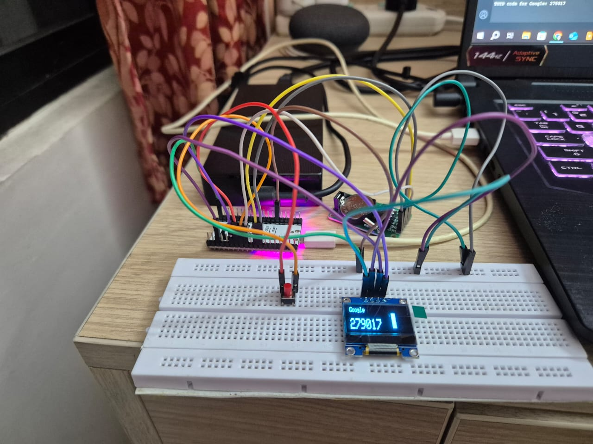
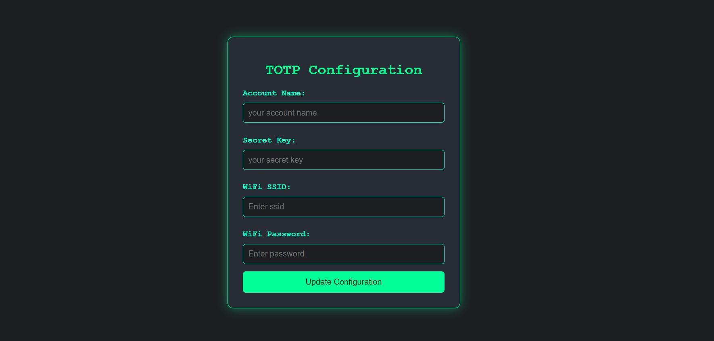

# ESP32 TOTP Generator

A secure hardware-based Time-based One-Time Password (TOTP) generator implemented on an ESP32 microcontroller. This device generates TOTP codes compatible with standard two-factor authentication systems and displays them on an OLED screen.

## Features

- 🔐 Secure TOTP code generation
- 📱 OLED display with visual countdown timer
- ⚡ Real-time synchronization via WiFi
- ⏰ Offline timekeeping with RTC module
- 🛠️ Web-based configuration interface
- 🔄 Visual progress indicator for code validity
- 💾 Persistent storage of settings
- 🔒 Access Point mode for secure configuration
- 🖥️ Serial monitoring for debugging

## Hardware Requirements

- ESP32 Development Board
- SSD1306 OLED Display (128x32)
- DS1302 RTC Module
- Push Button
- Status LED
- Connecting wires

### Build Output



### TOTP Configuration website



### Device in Action

[Watch the video](https://www.youtube.com/watch?v=t_AUBZh5xeY)

## Installation

1. Clone this repository:
   ```bash
   git clone https://github.com/sponge-24/hardware_2fa
   ```

2. Install the required libraries in Arduino IDE:
   - WiFi
   - Wire
   - NTPClient
   - TOTP
   - WebServer
   - Adafruit_GFX
   - Adafruit_SSD1306
   - ThreeWire
   - RtcDS1302

3. Connect the hardware components according to the pin configuration.

4. Upload the code to your ESP32 board.

## Configuration

### Initial Setup

1. Power on the device while holding the configuration button to enter AP mode
2. Connect to the "TOTP_Config_AP" WiFi network (password: "password")
3. Navigate to `192.168.4.1` in your web browser
4. Enter your configuration details:
   - Account Name
   - TOTP Secret Key
   - WiFi SSID
   - WiFi Password
5. Save the configuration and let the device restart

### Pin Definitions

```cpp
#define CLOCK_PIN 16     // CLK/SCL pin for RTC
#define DATA_PIN 17      // DAT/SDA pin for RTC
#define RST_PIN 18      // RST/CE pin for RTC
#define PUSH_BUTTON 19  // Configuration mode trigger
#define STATUS_LED 2    // Status LED pin
```

## Usage

1. Power on the device
2. The OLED display will show:
   - Account name
   - Current TOTP code
   - Visual countdown timer
3. To reconfigure, press and hold the push button to enter AP mode
4. The status LED indicates:
   - Blinking: Connecting to WiFi
   - Solid: Connected and operational
5. Monitor the serial output (115200 baud) for:
   - Startup information
   - WiFi connection status
   - Current TOTP codes
   - Debug messages

## Security Features

- Access Point mode only accessible via physical button press
- Web interface restricted to AP mode connections
- Secure storage of TOTP secrets in EEPROM

## Debug Output

The device outputs debugging information via the serial port at 115200 baud rate. You can monitor:
- Device initialization status
- WiFi connection details
- Current TOTP codes and account names
- Configuration changes
- Error messages

To view the serial output:
1. Connect the device to your computer via USB
2. Open Arduino IDE Serial Monitor or any serial terminal
3. Set the baud rate to 115200
4. Observe the real-time debug information

## Contributing

Contributions are welcome! Please feel free to submit a Pull Request.

## Acknowledgments

- ESP32 Community
- Adafruit Industries for the OLED library
- Contributors to the Arduino TOTP library and RTC DS1302 library

## Support

For issues, questions, or contributions, please open an issue in the GitHub repository.

---